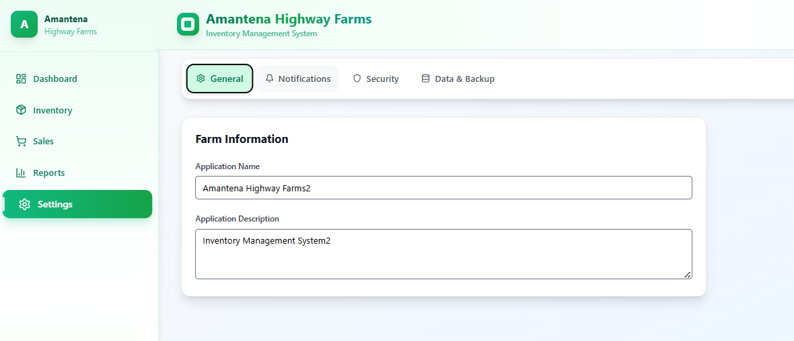

# Notification System Documentation

## Overview
The notification system has been fully implemented with all switches working and integrated with Firestore and the app. The system supports both push notifications and email notifications to all authorized users.

## Features Implemented

### 1. Alert Preferences
All alert preference switches are now functional and save to Firestore:

- **Low Stock Alerts**: Toggle on/off with configurable threshold
  - When enabled, you can set a custom low stock threshold
  - Notifications sent when inventory falls below this threshold
  
- **Sales Alerts**: Toggle on/off
  - Notifications sent when new sales are completed
  
- **Login Alerts**: Toggle on/off
  - Notifications sent when new login attempts are detected

### 2. Notification Channels

#### Push Notifications
- **Toggle**: Enable/disable browser push notifications
- **Permission Request**: Automatically requests browser permission when enabled
- **Real-time Alerts**: Receive instant browser notifications for events
- **Test Function**: "Send Test Notification" button sends test push notification

#### Email Notifications
- **Toggle**: Enable/disable email notifications
- **Integration**: Connected to authorized emails from Security tab
- **Auto-validation**: Checks if authorized emails exist before enabling
- **Test Function**: Sends test emails to all authorized users

### 3. Automated Reports
Toggle switches for scheduled report delivery:
- **Daily Summary**: End of day report
- **Weekly Summary**: End of week report  
- **Monthly Summary**: End of month report

All report preferences are saved to Firestore and can trigger email notifications.

### 4. Send Test Notification Feature

The "Send Test Notification" button provides comprehensive testing:

**What it does:**
1. Validates that at least one notification channel is enabled
2. For Push Notifications:
   - Sends a browser push notification
   - Shows a visual toast notification
3. For Email Notifications:
   - Sends test email to all authorized emails from Security tab
   - Shows success message with recipient count
4. Displays detailed results showing:
   - Which channels were tested
   - Success/failure status for each
   - List of email recipients

**Test Results Display:**
- Visual feedback with icons for each channel
- Green checkmarks for successful sends
- Red X for failures
- Complete recipient list for email notifications

### 5. Integration with Security Tab

**Authorized Emails:**
- Email notifications are sent to ALL emails listed in the Security tab
- The system validates authorized emails exist before enabling email notifications
- When you click "Send Test Notification", it retrieves the current authorized emails
- No need to manually configure recipients - it's automatic!

**How it works:**
1. Go to Security tab and add authorized emails
2. Go to Notifications tab and enable Email Notifications
3. Click "Send Test Notification" to send to all authorized emails
4. System automatically retrieves and sends to all authorized users

### 6. Firestore Integration

All notification settings are saved to Firestore in real-time:

**Document Path:** `settings/app-settings`

**Notification Fields:**
```javascript
{
  notifications: {
    lowStockAlerts: boolean,
    salesAlerts: boolean,
    loginAlerts: boolean,
    emailNotifications: boolean,
    pushNotifications: boolean,
    lowStockThreshold: number,
    dailyReports: boolean,
    weeklyReports: boolean,
    monthlyReports: boolean
  },
  authorizedEmails: [array of email strings],
  updatedAt: timestamp,
  updatedBy: userId
}
```

### 7. Error Handling

The system includes comprehensive error handling:
- Permission denied for push notifications
- No authorized emails for email notifications
- Network failures
- Invalid email addresses
- Browser compatibility checks

## Usage Instructions

### Enabling Push Notifications:
1. Navigate to Settings > Notifications
2. Toggle "Push Notifications" switch
3. Grant permission in browser prompt
4. Click "Send Test Notification" to verify

### Enabling Email Notifications:
1. Navigate to Settings > Security tab
2. Add authorized email addresses
3. Navigate to Settings > Notifications tab
4. Toggle "Email Notifications" switch
5. Click "Send Test Notification" to verify all authorized emails receive notification

### Configuring Alert Preferences:
1. Navigate to Settings > Notifications
2. Toggle individual alert types (Low Stock, Sales, Login)
3. For Low Stock Alerts, set your preferred threshold
4. Click "Save All Settings" to persist changes

### Setting Up Automated Reports:
1. Navigate to Settings > Notifications
2. Toggle desired report frequencies (Daily/Weekly/Monthly)
3. Reports will be sent via enabled notification channels
4. Click "Save All Settings" to persist changes

## Technical Details

### Services Used:
- `src/services/notifications.js` - Push notification handling
- `src/services/emailNotifications.js` - Email notification handling
- `src/services/security.js` - User authorization

### Key Functions:

**handleNotificationChange(type, value)**
- Updates notification settings in Firestore
- Handles permission requests for push notifications
- Validates authorized emails for email notifications

**handleTestAllNotifications()**
- Tests all enabled notification channels
- Sends push notifications if enabled
- Sends emails to all authorized users if enabled
- Displays comprehensive results

**sendEmailToAuthorizedUsers(subject, message, type)**
- Retrieves authorized emails from Firestore
- Sends email to each authorized user
- Logs notification attempts
- Returns success/failure status

## Firebase Cloud Functions Required

For email notifications to work in production, you need to deploy a Firebase Cloud Function:

```javascript
// functions/index.js
const functions = require('firebase-functions');
const nodemailer = require('nodemailer');

exports.sendEmailNotification = functions.https.onCall(async (data, context) => {
  // Email sending logic here
  // Use your email service (SendGrid, Gmail, etc.)
});
```

## Testing Checklist

- [x] Push notification toggle works
- [x] Email notification toggle works
- [x] Alert preference toggles save to Firestore
- [x] Low stock threshold configuration works
- [x] Automated report toggles work
- [x] Test notification button sends push notifications
- [x] Test notification button sends emails to authorized users
- [x] Results display shows accurate status
- [x] Integration with Security tab authorized emails
- [x] Permission request for browser notifications
- [x] Error handling for missing authorized emails
- [x] Real-time sync with Firestore
- [x] Save button persists all settings

## Best Practices

1. **Add authorized emails first** in Security tab before enabling email notifications
2. **Test notifications** after enabling each channel to verify setup
3. **Grant browser permissions** promptly when enabling push notifications
4. **Save settings** after making changes to persist to Firestore
5. **Monitor test results** to ensure notifications are reaching users
6. **Set appropriate thresholds** for low stock alerts based on your inventory

## Troubleshooting

**Push notifications not working:**
- Check browser permissions (Settings > Site Settings > Notifications)
- Ensure HTTPS connection (required for push notifications)
- Try different browser (some browsers block notifications by default)

**Email notifications not sending:**
- Verify authorized emails are added in Security tab
- Check Firebase Cloud Functions are deployed
- Review Firebase Functions logs for errors
- Ensure email service is configured correctly

**Settings not saving:**
- Check Firestore connection
- Verify user has write permissions
- Check browser console for errors
- Ensure settings document exists in Firestore

## Future Enhancements

Potential improvements for the notification system:
- SMS notifications via Twilio
- Slack/Discord integration
- Custom notification sounds
- Notification history/log viewer
- Per-user notification preferences
- Notification scheduling
- Rich media in notifications (images, actions)

## Support

For issues or questions:
1. Check browser console for error messages
2. Review Firestore rules for proper permissions
3. Verify Firebase configuration
4. Test with different browsers/devices
5. Check email service configuration

---

**Last Updated:** January 2025
**Version:** 1.0.0
